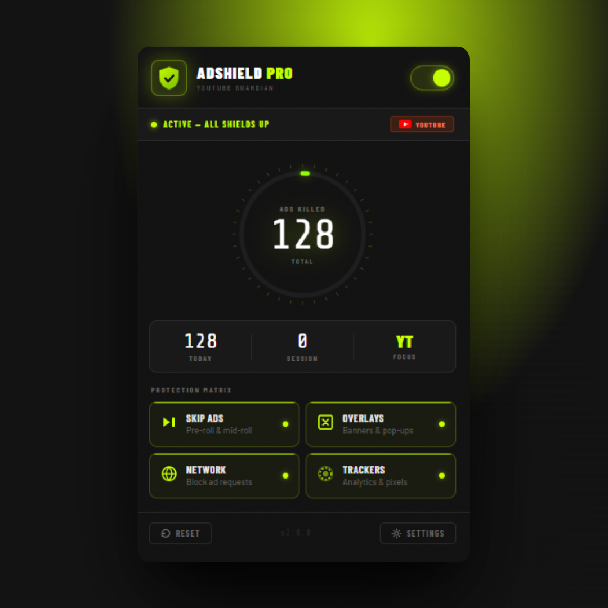

# 🛡️ AdShield Pro - YouTube Guardian

**The smoothest YouTube ad blocker. Kills pre-rolls, mid-rolls, overlays, and banner ads in real time.**

---

## 🎬 Say Goodbye to Ad Interruptions

Tired of YouTube ads ruining your binge-watching sessions? **AdShield Pro** is here to save you from the endless parade of commercials trying to sell you things you don't need!

---

## ✨ What Makes AdShield Pro Special?

### 🚀 Lightning-Fast Protection
- **Pre-roll & Mid-roll Killer** ⏭️ - Skip those annoying ads before your video even starts
- **Overlay Assassin** 🎯 - Banish floating banners and pop-ups trying to steal your screen
- **Network Guardian** 🌐 - Block ad requests before they even load
- **Tracker Terminator** 🔍 - Stop analytics and pixel tracking dead in its tracks

### 📊 Real-Time Stats
Watch the ads get demolished in real-time with our gorgeous counter. See exactly how many ads we've sacrificed to give you peace and quiet!

### 🎮 One-Click Control
Toggle protection on/off with a single click. Because sometimes you want to live dangerously (we won't judge).

---

## 🎯 Features at a Glance

| Feature | Description |
|---------|-------------|
| **Skip Ads** | Auto-skips pre-roll & mid-roll commercials |
| **Block Overlays** | Removes banners, pop-ups, and floating ads |
| **Network Blocking** | Prevents ad requests from reaching your browser |
| **Tracker Blocking** | Stops analytics and pixel tracking |
| **Live Counter** | Shows total ads eliminated (flex on them ads) |
| **Easy Toggle** | Enable/disable with one click |
| **Settings Panel** | Customize your protection matrix |

---

## 📥 Installation

1. Download **AdShield Pro** from the Chrome Web Store
2. Click the extension icon in your Chrome toolbar
3. Toggle it **ON** (the green glows look cool, we know)
4. Enjoy ad-free YouTube like it's 2008 again

---

## 🎮 How It Works

AdShield Pro uses advanced **Declarative Net Request** rules to intercept and block ads at the network level. Translation: It's so efficient, your ads don't even know what hit them.

The extension works by:
- ✅ Blocking known ad domains
- ✅ Removing ad-serving scripts before they load
- ✅ Stripping out tracking pixels
- ✅ Giving you back your YouTube experience

---

## 🔒 Privacy First

Your privacy is sacred. AdShield Pro:
- 🔐 Works entirely offline - no data collection
- 🔐 Only operates on YouTube
- 🔐 Never stores your watch history
- 🔐 Doesn't spy on you (unlike YouTube itself 👀)

---

## ⚙️ Requirements

- **Chrome 88+** (or any Chromium-based browser like Edge, Brave, Opera)
- YouTube account (optional, works on both logged-in and guest modes)
- A burning desire to watch videos without interruption

---

## 🐛 Issues & Feedback

Found a bug? Have a feature request? Want to tell us how much you love us?

We're all ears! Drop your feedback and we'll make AdShield even more legendary.

---

## 📝 Permissions

AdShield Pro requests the following permissions:

- **declarativeNetRequest** - To block ads at the network level
- **storage** - To remember your settings (like we remember every ad we killed)
- **tabs** - To identify YouTube tabs
- **scripting** - To inject our ad-blocking magic

---

## 🎉 Version History

**v2.0.0** - The Shield Upgrade
- Optimized performance for maximum ad destruction
- Smoother UI experience
- Enhanced tracking blocker
- New protection matrix design

---

## 🏆 Why Choose AdShield Pro?

✨ **Fastest** - Ads don't even get loaded
✨ **Simplest** - One click, done
✨ **Smartest** - Blocks ads you didn't even know existed
✨ **Funniest** - This README (you're welcome)

---

## 📜 License

Open-source and proud of it. Made with ❤️ and a healthy hatred for ads.

---

## 🚀 Ready to Shield Up?

**Download AdShield Pro now and reclaim your YouTube experience.**

Your videos are waiting. The ads are not.

---

**AdShield Pro** - *Because life's too short for ads* ⏭️✨
